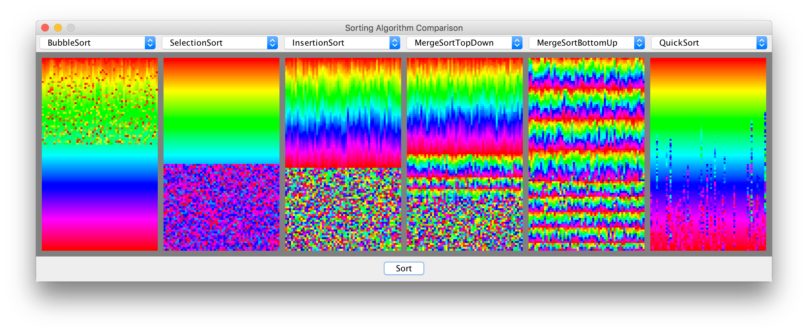

# Sorting Visual Comparison #

This project provides a visual side-by-side comparison of several common
sorting algorithms.



## Overview ##
The comparison window consists of several grids, each displaying the execution
of one algorithm.

Algorithms can be selected using the drop down menus at the top of the window, and ran
simultaneously using the button at the bottom.

Note that this comparison is purely visual, as algorithm implementation and dataset size
prevent any meaningful performance comparison. As such, algorithm delays have been set
so that all algorithms finish in approximately the same amount of time for randomly
shuffled data, although these can be edited.

### Features include: ###

* Comparing multiple algorithms side-by-side in one window
* Multiple shuffling methods
* Multiple visualization color schemes

### Included Algorithms: ###

* [Bubble Sort](https://en.wikipedia.org/wiki/Bubble_sort)
* [Selection Sort](https://en.wikipedia.org/wiki/Selection_sort)
* [Insertion Sort](https://en.wikipedia.org/wiki/Insertion_sort)
* [Merge Sort](https://en.wikipedia.org/wiki/Merge_sort)
    * Top Down
    * Bottom Up
* [Quicksort](https://en.wikipedia.org/wiki/Quicksort)

## Running ##

### Option 1: Run from .jar ###

Just run the precompiled [SortingComparison.jar](SortingComparison.jar).

### Option 2: Compile and run ###

Compile the contents of [src/](src) and run [Main](src/Main.java):
```
cd src
javac *.java
java Main
```

## Editing ##

Most settings can be changed by editing the class constants at the top of [SortingComparison.java](src/SortingComparison.java).
Additional sorters can be added by extending the [Sort](src/Sort.java) class and
then loading the pathfinder in the `main` method of [SortingComparison.java](src/SortingComparison.java) with:
```
this.algorithms.add(MyPathfinder.class);
this.algorithmDelays.put(MyPathfinder.class, 50);
```
The second line specifies the millisecond delay that will occur when `delay()` is called.
The implemented algorithm can use the following methods:
* `length()` -- Returns the length of the data being sorted.
* `get(i)` -- Returns the element at index i.
* `set(i, val)` -- Sets index i to store val.
* `delay()` -- Sleeps the thread for a set amount of time, allowing the sorting process to be seen. Best placed inside loops/methods at their ends.
Be aware that only changes made using `set()` will appear visually.

### Useful Editable Constants ###
* `GRID_WIDTH`, `GRID_HEIGHT` -- The size of the grids in cells.
* `CELL_SIZE` -- The size of each grid cell in pixels.
* `GRIDS_HORZ`, `GRIDS_VERT` -- The number of grids per row and per column in the window. `GRIDS_HORZ * GRIDS_VERT`
is the number of sorting algorithms that will be shown simultaneously.
* `DEFAULT_STEP_DELAY` -- The default delay between steps when running.
* `MARGIN_X`, `MARGIN_Y` -- The spacing around the grids in cells.
* `BORDER` -- The space between grids in cells.


## License ##
This project is licensed under the MIT license. See [LICENSE](LICENSE) for details.
